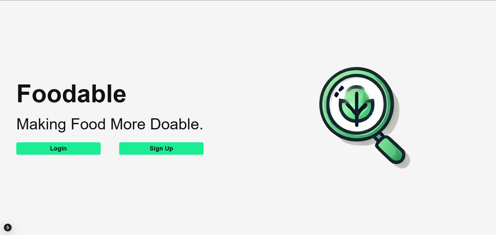

<h1>Hi, I'm Nick! 
<h2>About Me</h2>

I am a computer science student specializing in web and mobile app development, currently earning my bachelor's degree at Oregon State University. Proficient in object-oriented programming languages such as Python, C++ and Kotlin, I also have experience in C, JavaScript, and SQL. 
  
Collaborating in teams up to 7 members, I contributed to the development of multiple software applications. From creating information databases using MongoDB to designing image viewing and editing tools with Python, these experiences have enhanced my problem-solving abilities and my ability to communicate with colleagues.

I am constantly learning new programming languages and methodologies and always eager to acquire new skills that are relevant to web development. I welcome any opportunities to further my skills and contribute to impactful projects. Feel free to reach out to me for collaboration or new opportunities.

<h2>Experience</h2>

  <table cellspacing="0" cellpadding="0" style="max-width: 1000px; width: 100%; border: none; border-collapse: collapse;">
    <tr valign="top">
      <td style="min-width: 200px; width: 33%; padding: 0 30px; border: none;">
        <strong style="font-size: 1.2em;">Languages</strong>
        <ul>
          <li>C++/C</li>
          <li>Python</li>
          <li>Kotlin</li>
          <li>SQL</li>
          <li>JavaScript</li>
          <li>Typescript</li>
        </ul>
      </td>
      <td style="min-width: 200px; width: 33%; padding: 0 30px; border: none;">
        <strong style="font-size: 1.2em;">Tools</strong>
        <ul>
          <li>Git</li>
          <li>GitHub</li>
          <li>Android Studio</li>
          <li>VSCode</li>
          <li>Amazon Web Services</li>
          <li>VMWare Workstation</li>
        </ul>
      </td>
      <td style="min-width: 250px; width: 33%; padding: 0 30px; border: none;">
        <strong style="font-size: 1.2em;">Classes</strong>
        <ul>
          <li>System Administration</li>
          <li>Defense Against the Dark Arts</li>
          <li>Analysis of Algorithms</li>
          <li>Data Structures</li>
          <li>Intro to Computer Networks</li>
          <li>Intro to Databases</li>
          <li>Mobile Application Development</li>
          <li>Operating Systems</li>
          <li>Software Engineering</li>
          <li>Web Development</li>
        </ul>
      </td>
    </tr>
  </table>

<h2>👨‍💻 Software Development Projects</h2>

<ul>
  <li>
    <strong><a href="https://github.com/MrF1ow/foodable" target="_blank">Foodable - Making Food More Doable</a></strong> 
    Foodable is a smart and user-friendly application designed to help users find the most affordable grocery items nearby. It combines real-time data with location-based filtering to help users save money and time while shopping. Ideal for budget-conscious consumers, the app emphasizes usability, accessibility, and efficiency.  
      
  </li>
  
  <li>
    <strong><a href="https://github.com/nickcknelson/Personal-Website" target="_blank">Star Wars Quiz App (Android)</a></strong> 
    A fun and interactive quiz app for Star Wars fans, developed for Android devices.
  </li>
  
  <li>
    <strong><a href="https://github.com/nickcknelson/Personal-Website" target="_blank">Personal Portfolio Website</a></strong> 
    Built to showcase my work, skills, and development projects.
  </li>
  
  <li>
    <strong><a href="https://github.com/nickcknelson/Personal-Website" target="_blank">Image Viewer & Editor</a></strong> 
    A lightweight tool for viewing and editing images, integrated into my portfolio.
  </li>
</ul>

<h2>🤳 Connect with Me</h2>

<ul>
  <li>
    <strong><a href="https://linkedin.com/in/nickcknelson" target="_blank">LinkedIn</a></strong> – Let’s connect professionally!
  </li>
  <li>
    <strong><a href="https://nickcknelson.dev/" target="_blank">Personal Portfolio</a></strong> – Explore more about me, my work, and latest updates.
  </li>
</ul>
